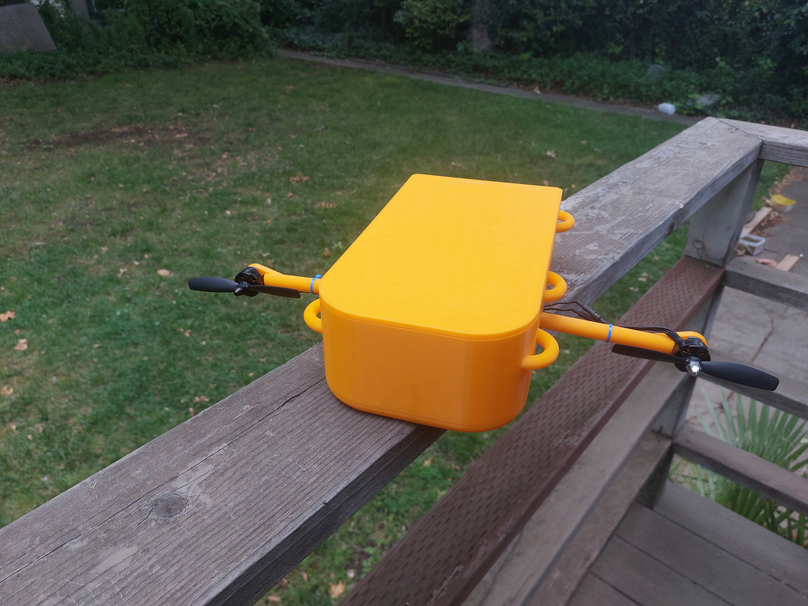
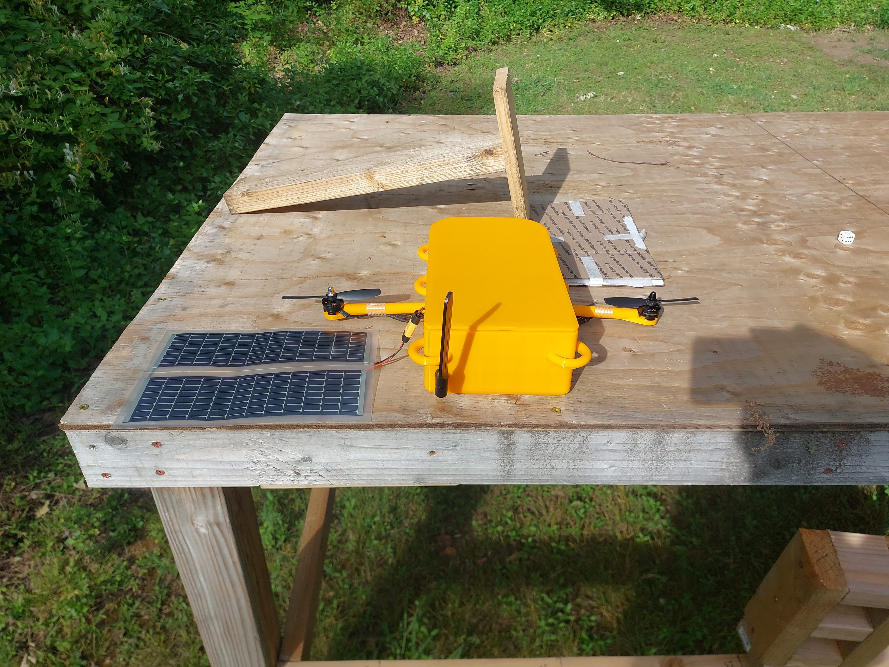
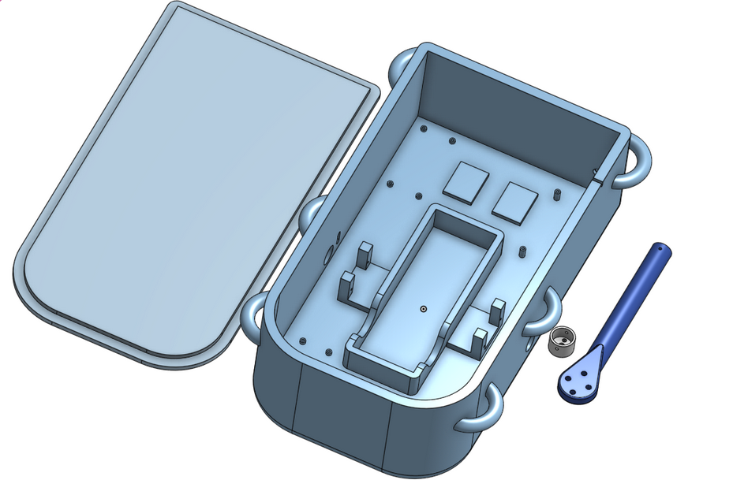

# Helium Blimp Gondola

Anders Beil and Alessio Tourrilhes EECE 490B senior capstone project implementation. Project was undertaken as our senior undergraduate design project.

---
<table align="center">
  <tr>
    <td></td>
    <td></td>
  </tr>
  <tr>
    <td></td>
    <td></td>
  </tr>
</table>
## Table of Contents
- [About](#about)
- [Features](#features)
- [Hardware](#hardware)
- [Software](#software)
- [Installation](#installation)
- [Contributors](#contributors)
---

## About

Current unmanned aerial vehicles (UAVs) have a gap in their capabilities. Drones are inexpensive but have limited flight duration, winged UAVs have longer flight times but come at a high cost. A small blimp UAV bridges this gap by being both affordable and capable of long duration flight. This blimp could be used for wildfire mapping, post-disaster search operations, or general area monitoring.

This projects object was to make the gondola that could then be attached to a blimp to be used as a surveilance blimp.

---

## Features

- Remote operation
- Receive commands via wireless LTE
- Magnetometer
- Image capture
- Configurable camera
- Battery powered with solar recharging
- Return home capeability 

---

## Hardware

Hardware needed to replicate project.

- Adafruit Ultimate GPS Breakout - PA1616S
- BNO055 9-axis Sensor
- Brushless ESC 2S 20A Electric Speed Controller
- CN3722 Solar MPPT Charger
- FEICHAO 2204 2300KV Brushless Motors
- Jx-2s-Jh10 BMS Board
- MG90D 270 Degree Servo Motors
- PCA9685 Servo Driver
- Raspberry Pi Camera Module 3
- Raspberry Pi Zero 2 W
- RC7.2-75 PSAF Solar Panels
- SIM7600G-H 4G HAT (B)
- Turnigy Rapid 2S2P 8000mAh Lipo Battery

---

## Software

- Python 3
- adafruit_bno055
- adafruit_pca9685
- pygeomag
- pynmea2
- RClone
- rpicam
- mmcli

---

## Installation

OS settings
Ensure ModemManager Active
```bash
sudo systemctl enable ModemManager
sudo systemctl start ModemManager
```

In raspi-config
```bash
sudo raspi-config
```
Options:
Interface options
- ssh enabled
- I2C Enabled
- Serial port
  - The serial login shell is disabled
  - The serial interface is enabled

Create a venv to be able to use adafruit packages
```bash
python3 -m venv venv
source venv/bin/activate
```
install packages
```bash
sudo apt install rclone
sudo apt install modemmanager
sudo apt install libcamera-apps

pip install adafruit-blinka
pip install smbus2
pip install adafruit-circuitpython-bno055
pip install adafruit-circuitpython-pca9685
pip install pygeomag
pip install pynmea2
```

Make services for sripts to be ran automaticaly on startup
```bash
cd /etc/systemd/system/
nano servicename.service
```
Make 1 for each file thrustvector.py, recvfinal.py, and uploadfinal.py
```ini
Description=Blimp Startup Script
After=network.target

[Service]
User=<USER>
WorkingDirectory=<SCRIPT DIRECTORY>
ExecStart=<VENV PATH> <SCRIPT PATH>
Restart=always

[Install]
WantedBy=multi-user.target
```

### Clone the Repository

```bash
git clone https://github.com/akbeil/EECE_490_Blimp_Gondola.git
```
## Contributors

- Anders Beil
     - akbeil@csuchico.edu  
- Alessio Tourrilhes
     - atourrilhes@csuchico.edu
     
### Advisor 
- Dr. Reza Khani
     - mkhani@csuchico.edu
